<div align="center">


# ShopSmart — Personalized Product Recommendations

### 🌐 [Live Demo](https://smart-shop-steel.vercel.app)


Elegant Next.js app that showcases AI‑assisted product recommendations, protected routes, onboarding‑driven personalization, and a polished UI component system. This README documents only the frontend app. The `Smart-shop-Backend/` folder is intentionally ignored for this task.

</div>

---

## Tech Stack

- **Framework**: Next.js 15 (App Router, Server/Route Handlers)
- **Language**: TypeScript
- **UI**: Tailwind CSS v4, Radix UI, custom components in `src/components/ui`
- **State/Forms**: React Hook Form + Zod
- **Auth**: Better Auth (cookies plugin for Next.js)
- **DB**: MongoDB (via `mongodb` driver)
- **LLM**: Google Gemini (server‑side, SSE stream)

---

## Project Structure
```text
src/
  app/
    (auth)/                 # Auth-only wrapper; redirects based on profile
      signin/               # Sign in form
      signup/               # Sign up form
    (protected)/            # Requires session; checks onboarding
      products/             # Full product catalog + filters
      recommended/          # AI recommendations UI
      onboarding/           # Profile onboarding
      profile/              # Profile page
    api/
      auth/[...all]/        # Better Auth handler (GET/POST)
      profile/              # GET/POST/PATCH profile data
      recommendations/      # POST → SSE stream of AI recs
        product/            # POST → content-based similar items
  components/               # UI kit, filters, cards, layout, loaders
  data/                     # products.json (catalog), sample-recommendations.json
  lib/                      # auth, db connection, utils
  types/                    # TS types for profile/recommendation
```

### App Architecture
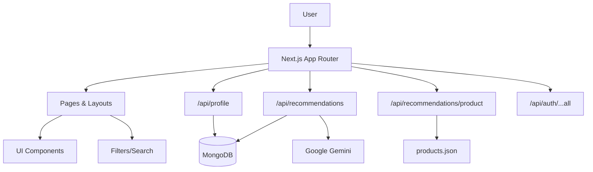
```mermaid
graph TD
  A[User] --> B[Next.js App Router]
  B --> C[Pages & Layouts]
  C --> D[UI Components]
  C --> E[Filters/Search]
  B --> F["/api/profile"]
  B --> G["/api/recommendations"]
  B --> H["/api/recommendations/product"]
  B --> I["/api/auth/...all"]
  F --> J[(MongoDB)]
  G --> J
  H --> K["products.json"]
  G --> L["Google Gemini"]
```

### Recommendation Flow (SSE)
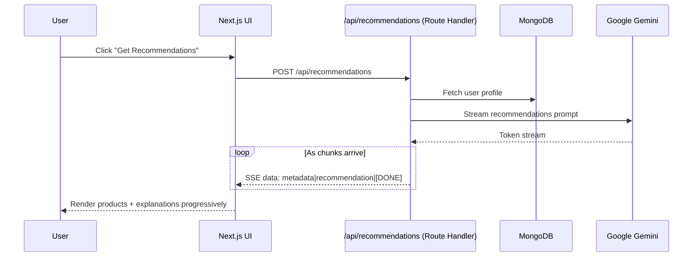
```mermaid
sequenceDiagram
  participant U as User
  participant FE as Next.js UI
  participant RH as /api/recommendations (Route Handler)
  participant DB as MongoDB
  participant LLM as Google Gemini

  U->>FE: Click "Get Recommendations"
  FE->>RH: POST /api/recommendations
  RH->>DB: Fetch user profile
  RH->>LLM: Stream recommendations prompt
  LLM-->>RH: Token stream
  loop As chunks arrive
    RH-->>FE: SSE data: metadata|recommendation|[DONE]
  end
  FE-->>U: Render products + explanations progressively
```

### Content and Collaborative Filtering
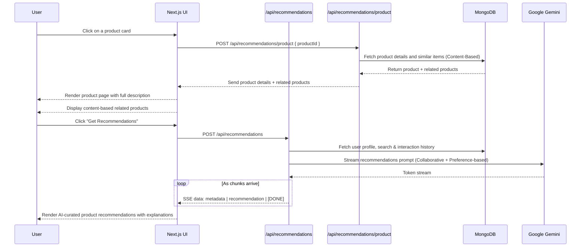
```mermaid
sequenceDiagram
  participant U as User
  participant FE as Next.js UI
  participant RH_AI as /api/recommendations
  participant RH_CB as /api/recommendations/product
  participant DB as MongoDB
  participant LLM as Google Gemini

  %% User clicks product card
  U->>FE: Click on a product card
  FE->>RH_CB: POST /api/recommendations/product { productId }
  RH_CB->>DB: Fetch product details and similar items (Content-Based)
  DB-->>RH_CB: Return product + related products
  RH_CB-->>FE: Send product details + related products
  FE-->>U: Render product page with full description
  FE-->>U: Display content-based related products

  %% User clicks "Get AI Recommendations" (collaborative + profile-based)
  U->>FE: Click "Get Recommendations"
  FE->>RH_AI: POST /api/recommendations
  RH_AI->>DB: Fetch user profile, search & interaction history
  RH_AI->>LLM: Stream recommendations prompt (Collaborative + Preference-based)
  LLM-->>RH_AI: Token stream
  loop As chunks arrive
    RH_AI-->>FE: SSE data: metadata | recommendation | [DONE]
  end
  FE-->>U: Render AI-curated product recommendations with explanations
```

---

## API (Frontend Route Handlers)

### Auth
- `GET | POST /api/auth/[...all]` – Better Auth handler (email/password enabled)

### Profile
- `GET /api/profile` – returns `{ profile }`, requires session
- `POST /api/profile` – create/update onboarding payload; sets `onboardingCompleted: true`
- `PATCH /api/profile` – partial updates and actions
  - `{ action: "addSearchHistory", searchTerm: string }`
  - or profile fields (gender, address, favoriteCategories, priceRange, interests, lifestyle, etc.)

### Recommendations (AI, SSE)
- `POST /api/recommendations` – requires session
  - Streams `text/event-stream` with events shaped as:
    - `{"type":"metadata","totalFiltered":number,"totalProducts":number}`
    - `{"type":"recommendation","data":{ product, explanation, relevanceScore, matchReasons }}`
    - `[DONE]` when finished

### Product‑similar Recommendations (content‑based)
- `POST /api/recommendations/product`
  - Body: `{ productId: string, limit?: number }`
  - Returns: `{ data: Product[] }`
---
# Features & Screenshots

1. **Test AI Recommendations Without Login**  
   Paste products JSON and user preferences to instantly preview LLM-powered suggestions.  
   <div align="center">
     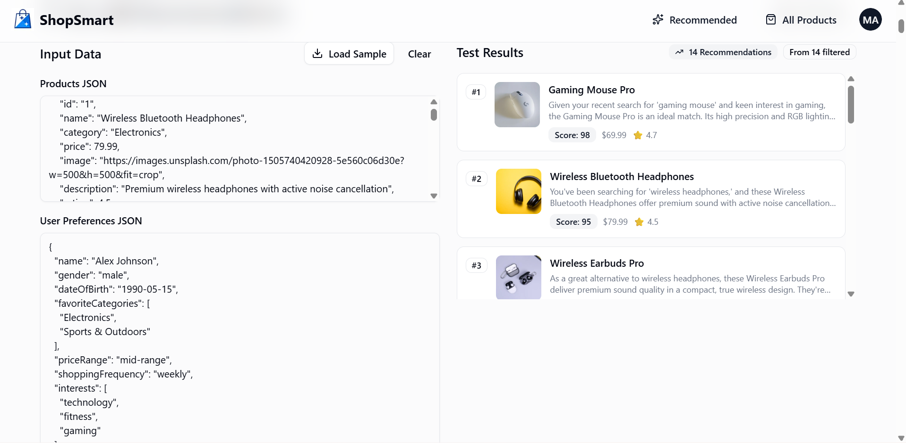
   </div>

2. **Authentication**  
   Secure login and signup with Better Auth.  
   <div align="center">
     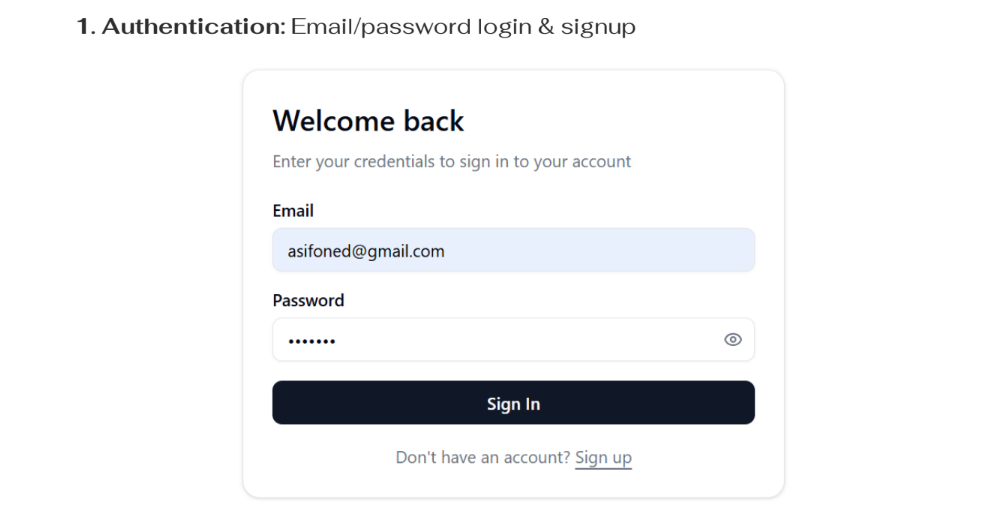
   </div>

3. **Onboarding Flow**  
   Capture preferences: categories, price range, lifestyle, and interests.  
   <div align="center">
     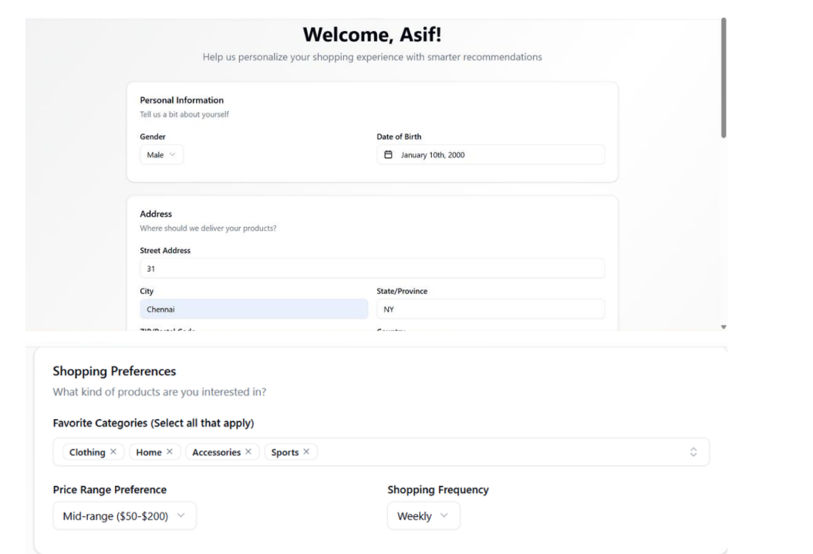
   </div>

4. **Profile Dashboard**  
   View saved preferences and activity history.  
   <div align="center">
     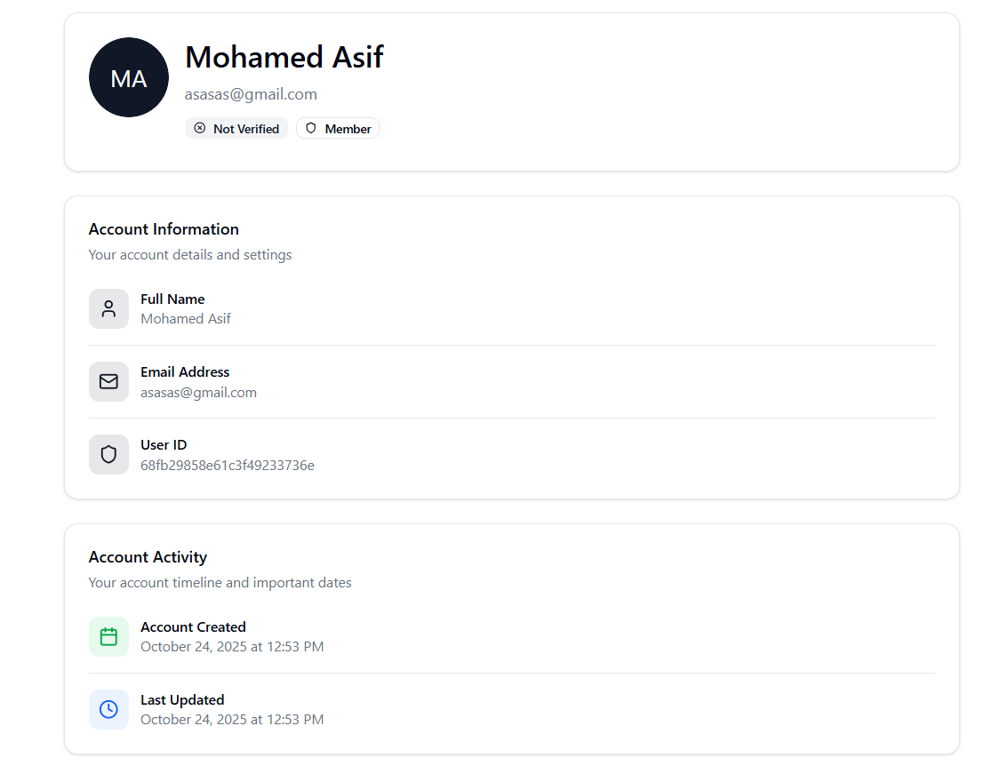
     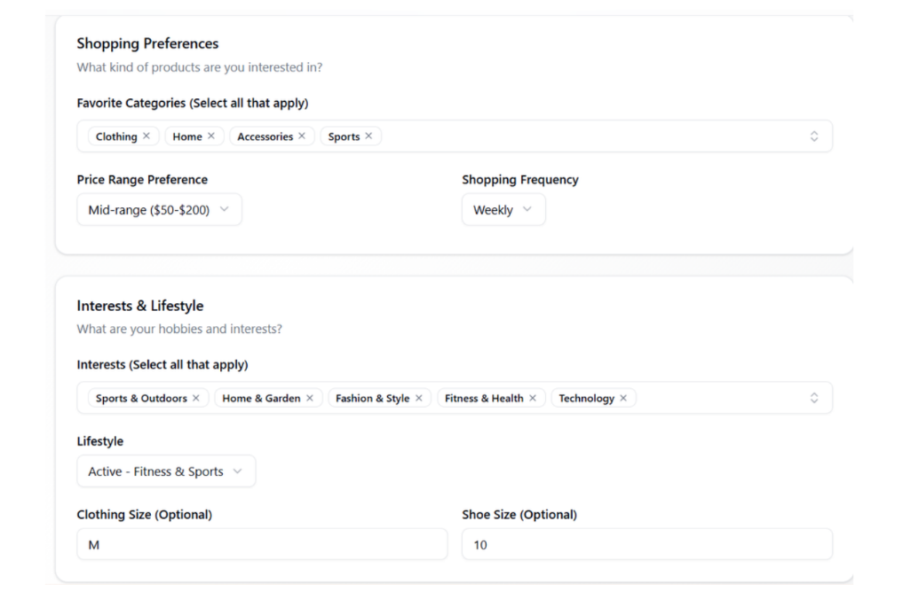
   </div>

5. **Product Catalog**  
   Browse with rich filters and responsive layout.  
   <div align="center">
     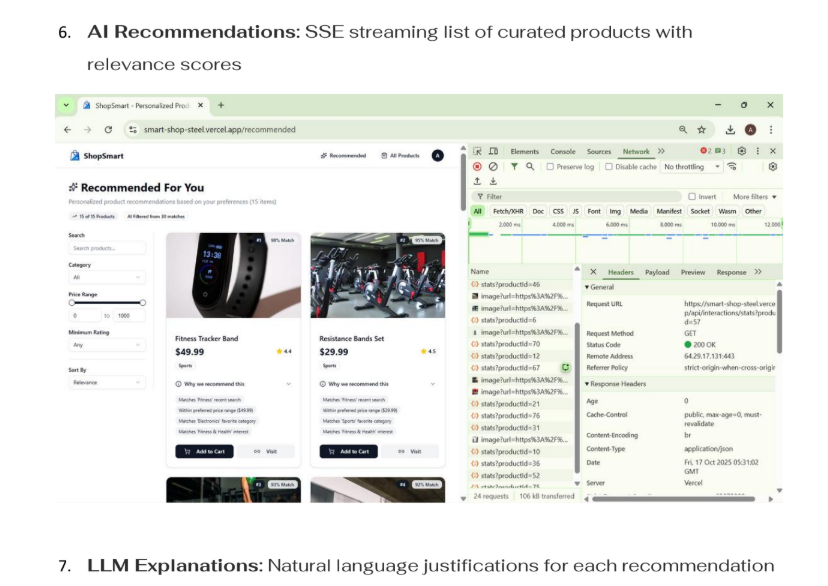
     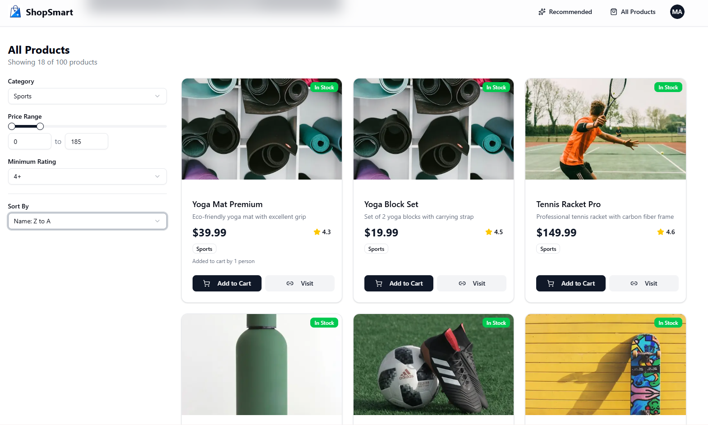
   </div>

6. **Product Details**  
   Full description with content-based similar items.  
   <div align="center">
     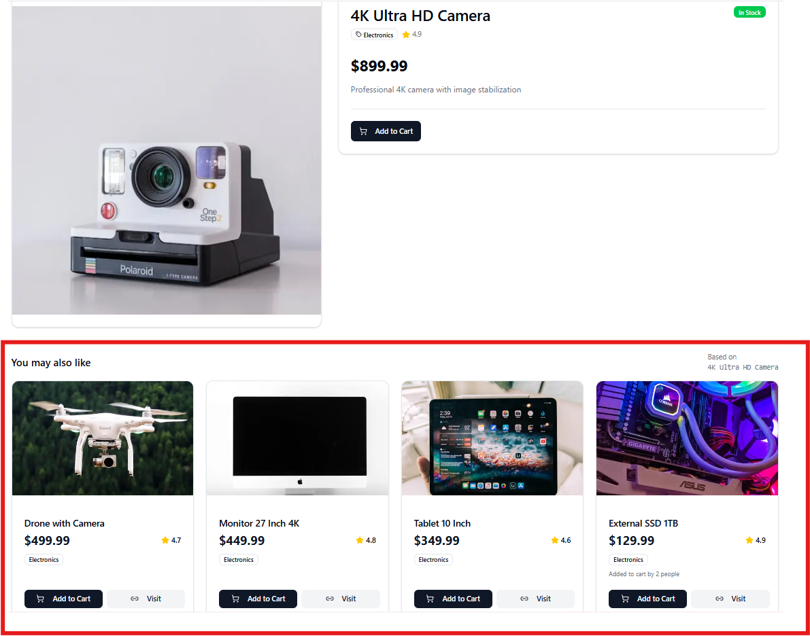
   </div>

7. **Search Behavior Patterns**  
   Shows previous searches and personalized suggestions based on interactions.  
   <div align="center">
     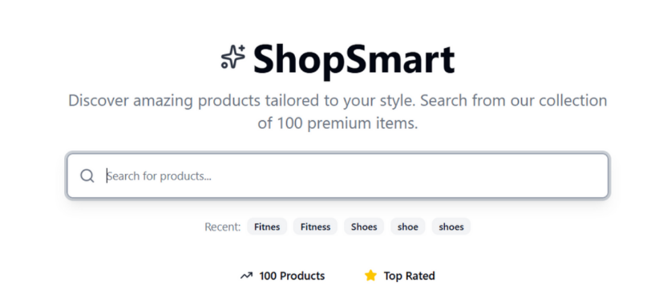
   </div>

8. **AI Recommendations with LLM Explanations**  
   Click "Get Recommendations" to trigger SSE streaming with relevance scores and "Why this product?" justifications.  
   <div align="center">
     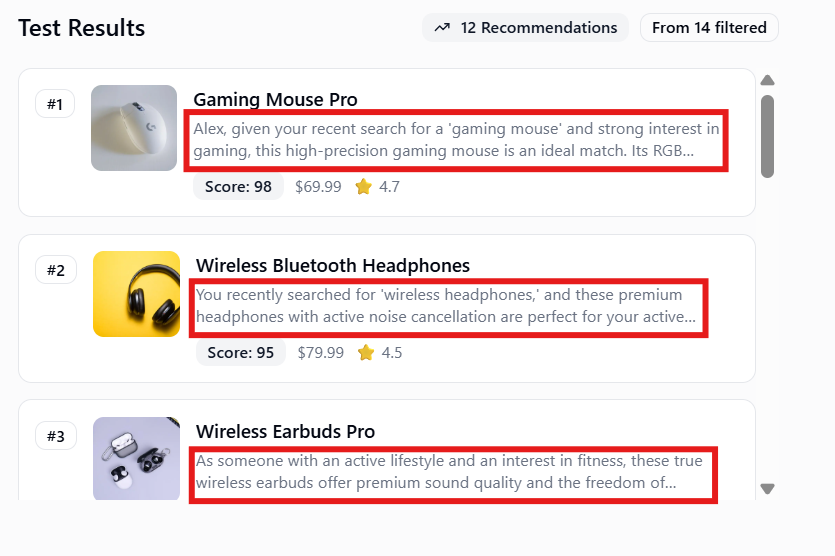
     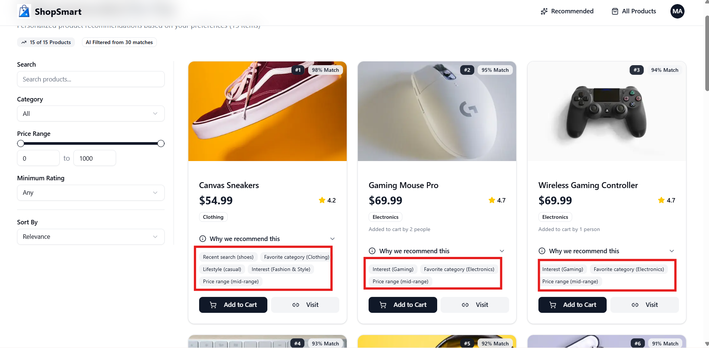
   </div>

9. **Interaction API**  
   Clicking "Add to Cart" triggers POST request — check network tab for 200 OK response with payload.  
   <div align="center">
     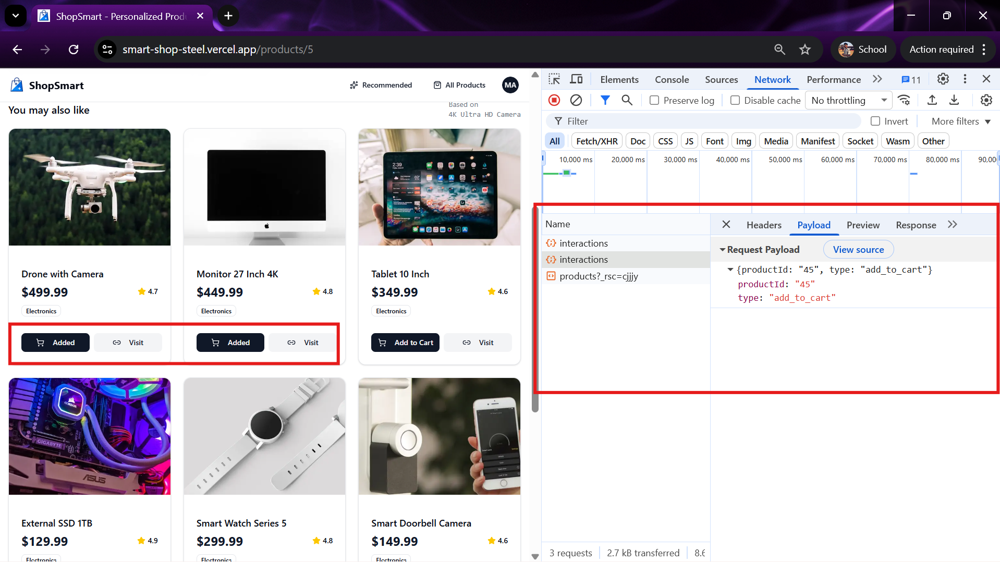
   </div>
---

## Demo Video

<div align="center">
  
**[📹 Watch Full Demo Video](./Demonstration%20Video/Project_Demo.mp4)**

https://github.com/user-attachments/assets/ec446a03-a516-4395-8340-4cc7c81ce034

<br/>
<p><em>Complete walkthrough of all features</em></p>
</div>

---
## Environment Variables

Create a `.env.local` at the project root:
```bash
MONGODB_URI=mongodb+srv://<user>:<pass>@<cluster>/<db>?retryWrites=true&w=majority
GEMINI_API_KEY=your_gemini_api_key
NEXT_PUBLIC_BASE_URL=http://localhost:3000
```

---

## Scripts
```bash
npm run dev      # Start development server
npm run build    # Build for production
npm run start    # Start production server
npm run lint     # Run ESLint
```

---

## Quickstart

1. Install dependencies: `npm install`
2. Add `.env.local` (see above)
3. Start dev server: `npm run dev`
4. Visit `http://localhost:3000`

---


## License

This project is part of an interview task and is for demonstration purposes.

---

<div align="center">
  Made by Mohamed Asif M 22BCE1634
</div>
