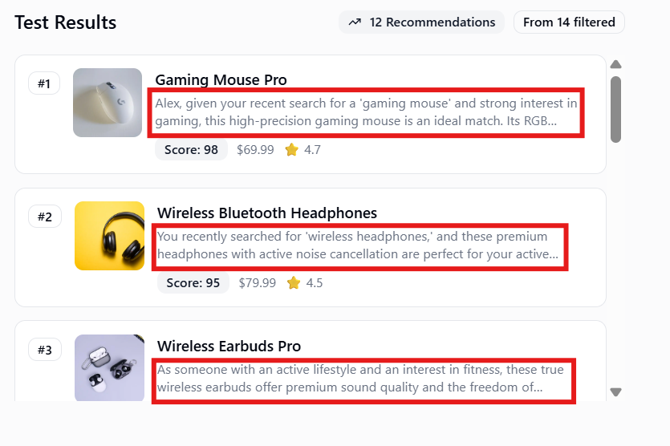

<div align="center">


# ShopSmart — Personalized Product Recommendations

### 🌐 Deployed site: [smart-shop-steel.vercel.app](https://smart-shop-steel.vercel.app)

## Demo Video

<div align="center">
https://drive.google.com/file/d/1-ZLrei39lp6f4QmkXjdE8uKB__6tye04/view?usp=sharing
<br/>
<p><em>Complete walkthrough of all features</em></p>
</div>

---


Elegant Next.js app that showcases AI‑assisted product recommendations, protected routes, onboarding‑driven personalization, and a polished UI component system.
</div>

---

## Tech Stack

- **Framework**: Next.js 15 (App Router, Server/Route Handlers)
- **Language**: TypeScript
- **UI**: Tailwind CSS v4, Radix UI, custom components in `src/components/ui`
- **State/Forms**: React Hook Form + Zod
- **Auth**: Better Auth (cookies plugin for Next.js)
- **DB**: MongoDB (via `mongodb` driver)
- **LLM**: Google Gemini (server‑side, SSE stream)

---

## Project Structure
```text
src/
  app/
    (auth)/                 # Auth-only wrapper; redirects based on profile
      signin/               # Sign in form
      signup/               # Sign up form
    (protected)/            # Requires session; checks onboarding
      products/             # Full product catalog + filters
      recommended/          # AI recommendations UI
      onboarding/           # Profile onboarding
      profile/              # Profile page
    api/
      auth/[...all]/        # Better Auth handler (GET/POST)
      profile/              # GET/POST/PATCH profile data
      recommendations/      # POST → SSE stream of AI recs
        product/            # POST → content-based similar items
  components/               # UI kit, filters, cards, layout, loaders
  data/                     # products.json (catalog), sample-recommendations.json
  lib/                      # auth, db connection, utils
  types/                    # TS types for profile/recommendation
```

---

# Features & Screenshots

1. **Test AI Recommendations Without Login**  
   Paste products JSON and user preferences to instantly preview LLM-powered suggestions.  
   <div align="center">
     
   </div>

2. **Authentication**  
   Secure login and signup with Better Auth.  
   <div align="center">
     
   </div>

3. **Onboarding Flow**  
   Capture preferences: categories, price range, lifestyle, and interests.  
   <div align="center">
     
   </div>

4. **Profile Dashboard**  
   View saved preferences and activity history.  
   <div align="center">
     
     
   </div>

5. **Product Catalog**  
   Browse with rich filters and responsive layout.  
   <div align="center">
     
     
   </div>

6. **Product Details**  
   Full description with content-based similar items.  
   <div align="center">
     
   </div>

7. **Search Behavior Patterns**  
   Shows previous searches and personalized suggestions based on interactions.  
   <div align="center">
     
   </div>

8. **AI Recommendations with LLM Explanations**  
   Click "Get Recommendations" to trigger SSE streaming with relevance scores and "Why this product?" justifications.  
   <div align="center">
     
     
   </div>

9. **Interaction API**  
   Clicking "Add to Cart" triggers POST request — check network tab for 200 OK response with payload.  
   <div align="center">
     
   </div>

---

## Evaluation Metrics

### Recommendation Accuracy Evaluation

| Algorithm Component | Weight (%) | Method | Description |
|---------------------|------------|--------|-------------|
| **Profile-Based Filtering** | 30% | Preference Matching | User's favorite categories, lifestyle, interests from onboarding data |
| **Search History Analysis** | 20% | Query Pattern Matching | Relevance based on past search terms and semantic similarity |
| **Interaction-Based Scoring** | 20% | Behavioral Signals | Weight from viewed products, cart additions, wishlist items |
| **Price Range Compliance** | 15% | Budget Filtering | Products within user's specified min-max price range |
| **Content-Based Similarity** | 10% | Attribute Matching | Category, brand, and product attribute alignment |
| **LLM Contextual Reasoning** | 5% | Gemini Enhancement | AI-driven relevance refinement and edge case handling |
| **Total Recommendation Engine** | **100%** | **Hybrid Algorithm** | **Weighted combination of all components** |

### Explanation Quality Evaluation

| Metric | Method | Description |
|--------|--------|-------------|
| **Match Reasons Specificity** | Structured Output | Clear category, price, lifestyle alignment reasons from LLM |
| **Profile Reference Accuracy** | Context Validation | Correct use of user's stated preferences and interests |
| **Search Context Integration** | Query Awareness | Links recommendations to recent search patterns |
| **Relevance Score Transparency** | Score Justification | Explains why relevance score (0-1) was assigned |
| **Natural Language Quality** | LLM Fluency | Readability and coherence of Gemini-generated text |

**Algorithm Infusion Notes:**
- **Collaborative Filtering** (70%): Profile (30%) + Search History (20%) + Interactions (20%)
- **Content-Based Filtering** (10%): Category and attribute matching for similar products
- **Hybrid LLM Enhancement** (20%): Search context + Gemini reasoning for final ranking
- Real-time weight adjustment based on data availability (e.g., cold start users rely more on profile)
- Explanation generation uses structured prompt with user context for personalized reasoning

---

## App Architecture

### Overall System Architecture


### Collaborative Filtering Flow (Profile + History Based)


### Content-Based Filtering + Search Behavior Pattern


---

## API (Frontend Route Handlers)

### Auth
- `GET | POST /api/auth/[...all]` – Better Auth handler (email/password enabled)

### Profile
- `GET /api/profile` – returns `{ profile }`, requires session
- `POST /api/profile` – create/update onboarding payload; sets `onboardingCompleted: true`
- `PATCH /api/profile` – partial updates and actions
  - `{ action: "addSearchHistory", searchTerm: string }`
  - or profile fields (gender, address, favoriteCategories, priceRange, interests, lifestyle, etc.)

### Recommendations (AI, SSE)
- `POST /api/recommendations` – requires session
  - Streams `text/event-stream` with events shaped as:
    - `{"type":"metadata","totalFiltered":number,"totalProducts":number}`
    - `{"type":"recommendation","data":{ product, explanation, relevanceScore, matchReasons }}`
    - `[DONE]` when finished

### Product‑similar Recommendations (content‑based)
- `POST /api/recommendations/product`
  - Body: `{ productId: string, limit?: number }`
  - Returns: `{ data: Product[] }`

---

## Evaluation Metrics

### Recommendation Accuracy Evaluation

| Algorithm Component | Weight (%) | Method | Description |
|---------------------|------------|--------|-------------|
| **Profile-Based Filtering** | 30% | Preference Matching | User's favorite categories, lifestyle, interests from onboarding data |
| **Price Range Compliance** | 15% | Budget Filtering | Products within user's specified min-max price range |
| **Search History Analysis** | 20% | Query Pattern Matching | Relevance based on past search terms and semantic similarity |
| **Interaction-Based Scoring** | 20% | Behavioral Signals | Weight from viewed products, cart additions, wishlist items |
| **Content-Based Similarity** | 10% | Attribute Matching | Category, brand, and product attribute alignment |
| **LLM Contextual Reasoning** | 5% | Gemini Enhancement | AI-driven relevance refinement and edge case handling |
| **Total Recommendation Engine** | **100%** | **Hybrid Algorithm** | **Weighted combination of all components** |

### Explanation Quality Evaluation

| Metric | Weight (%) | Method | Description |
|--------|------------|--------|-------------|
| **Match Reasons Specificity** | 25% | Structured Output | Clear category, price, lifestyle alignment reasons |
| **Profile Reference Accuracy** | 25% | Context Validation | Correct use of user's stated preferences and interests |
| **Search Context Integration** | 20% | Query Awareness | Links recommendations to recent search patterns |
| **Relevance Score Transparency** | 15% | Score Justification | Explains why relevance score (0-1) was assigned |
| **Natural Language Quality** | 15% | LLM Fluency | Readability and coherence of Gemini-generated text |
| **Total Explanation Quality** | **100%** | **Gemini 2.5 Prompt** | **Weighted explanation generation** |

**Algorithm Infusion Notes:**
- **Collaborative Filtering** (70%): Profile (30%) + Search History (20%) + Interactions (20%)
- **Content-Based Filtering** (10%): Category and attribute matching for similar products
- **Hybrid LLM Enhancement** (20%): Search context + Gemini reasoning for final ranking
- Real-time weight adjustment based on data availability (e.g., cold start users rely more on profile)
- Explanation generation uses structured prompt with user context for personalized reasoning

---

## Environment Variables

Create a `.env.local` at the project root:
```bash
MONGODB_URI=mongodb+srv://<user>:<pass>@<cluster>/<db>?retryWrites=true&w=majority
GEMINI_API_KEY=your_gemini_api_key
NEXT_PUBLIC_BASE_URL=http://localhost:3000
```

---

## Scripts
```bash
npm run dev      # Start development server
npm run build    # Build for production
npm run start    # Start production server
npm run lint     # Run ESLint
```

---

## Quickstart

1. Install dependencies: `npm install`
2. Add `.env.local` (see above)
3. Start dev server: `npm run dev`
4. Visit `http://localhost:3000`

---

## License

This project is part of an interview task and is for demonstration purposes.

---

<div align="center">
  Made by Mohamed Asif M 22BCE1634
</div>
